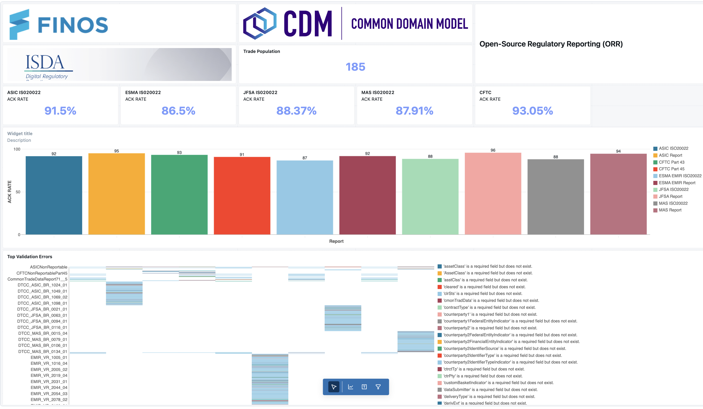
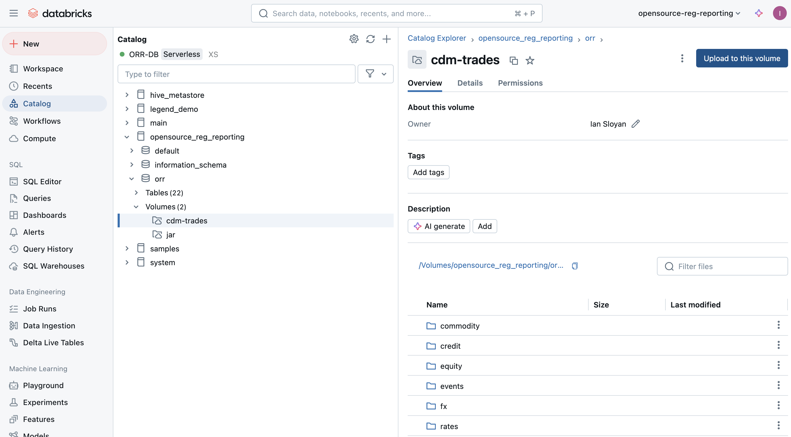
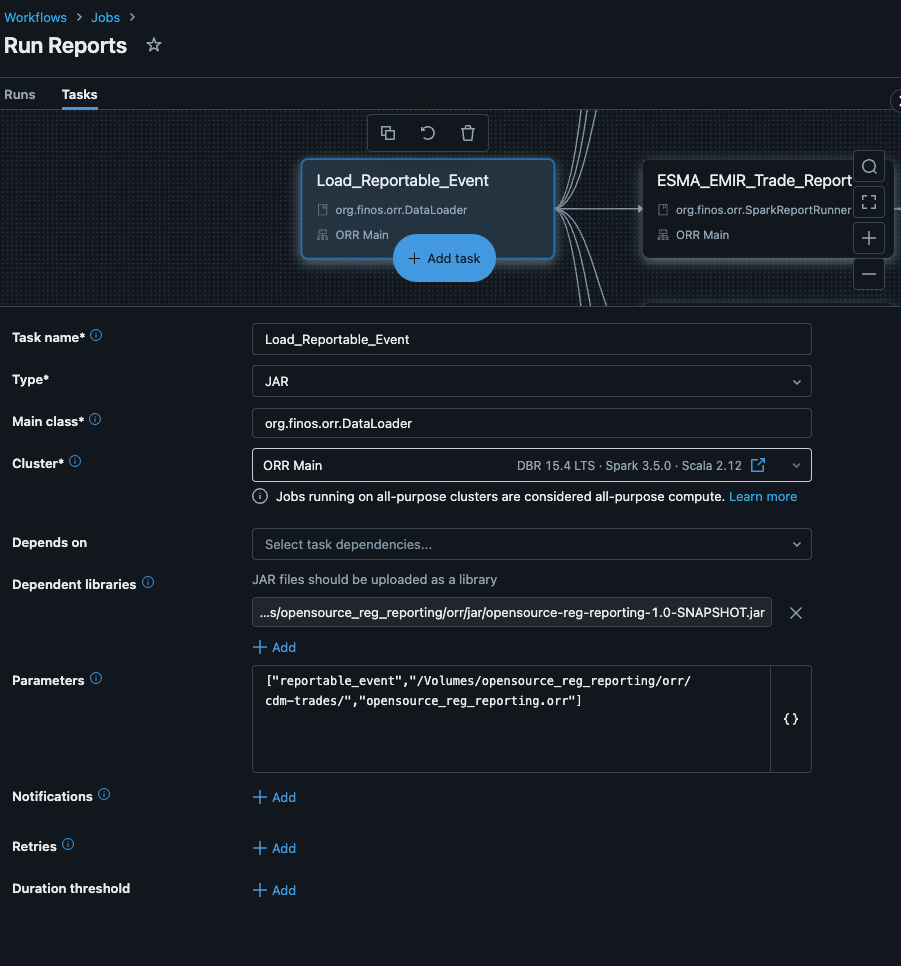
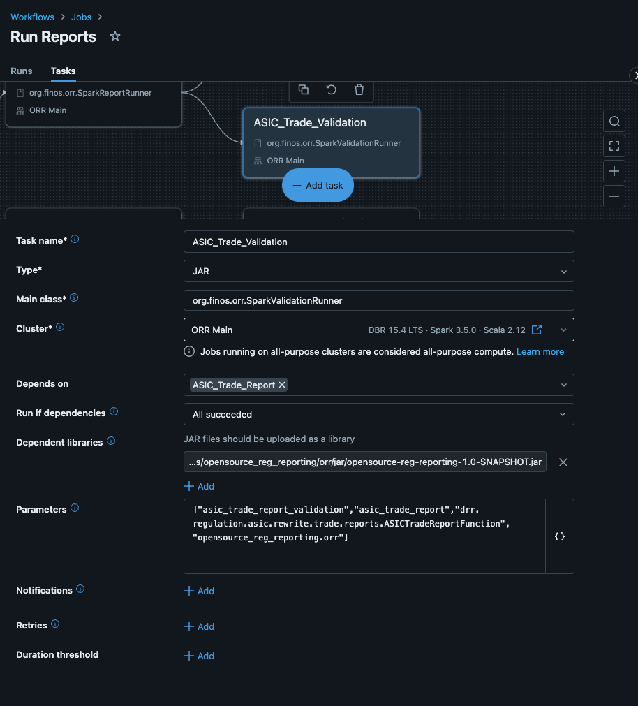

# Opensource Regulatory Reporting

Open-Source Regulatory Reporting (ORR) is a project originating from the Reg Tech SIG at FINOS. It aims to build on the work done by industry participants to date in the area of Regtech and SupTech and provide some technical resources to further advance the adoption of Regtech solutions by providing reference implementations, connectivity solutions between existing open source projects and solutions in the market to further advance to their shared goal of better regulatory oversight in more efficient ways.

Phase 1 of ORR is presented here, providing the code, directions to the resources, and step by step instructions (in this README file) for how to run ISDA's DRR code on Apach Spark. This is achieved using Databricks' platform. With CDM sample data loaded into Databricks as the test trade data to demonstrate how DRR code maps trade data to trade reports for a number of global regulatory regimes and then validates the outcomes against regulators' published validation rules. Finally the DRR code maps the reports into the necessary ISO20022 formats defined by regulators' published schemas and validates the XML output that would go to a trade repository. All these steps and outcomes are persisted in the database as tables for each step for each regulatory reporting regime. Spark SQL code is also provided to generate a dashboard of statistics of the performance of the reporting agains the requirements (i.e. the validatin results) - this is demobstrated via the Databricks Dashboard screen and provides a typical view that operations teams at a financial institution responsible for reporting processes would monnitor.




## Prerequisites
- Basic Java, Maven and Git knowledge.
- Basic knowledge of [databricks](https://docs.databricks.com/en/index.html).
- **Databricks Cluster**: You need a running Databricks cluster with the appropriate Spark runtime version and libraries installed.
    - Get set up [here](https://docs.databricks.com/en/getting-started/community-edition.html)
- **Input Data**: The input data should be loaded into a Delta Lake table in the specified catalog and schema.
    - Download from the [DRR Distribution](https://drr.docs.rosetta-technology.io/source/download.html)
- **Application JAR**: The compiled JAR file of the project should be uploaded to a Databricks volume.
    - See section [Build the project](#build-the-project)
    - 
## Build

1. **Checkout the project:**
   ```bash
   git clone https://github.com/finos-labs/opensource-reg-reporting.git
   cd opensource-reg-reporting
   ```

2. **Build the project:**
   ```bash
   mvn clean install
   ```
   This will compile the code, run tests, and package the application into a JAR file located in the `target` directory called `opensource-reg-reporting-1.0-SNAPSHOT.jar`
   > **Note:** The project uses the Maven Shade plugin to create a "fat JAR" that includes all the necessary DRR (Data Regulatory Reporting) dependencies. The Apache Spark dependencies are marked as "provided" in the `pom.xml` file, as these will be available in the Databricks environment where the application will be deployed.

3. Applications in this Project
- **[DataLoader.java](src/main/java/org/finos/orr/DataLoader.java)**: Spark application to load data from a directory into a Spark table
    - **output-table**: Name of the output table.
    - **input-path**: The path to the directory containing the data files.
    - **catalog.schema**: Name of the database/schema.
- **[SparkReportRunner.java](src/main/java/org/finos/orr/SparkReportRunner.java)**: Spark application to run a Report (e.g. ESMA EMIR) and save the results on a Spark table
    - **output-table**: Name of the output table.
    - **input-table**: Name of the input table.
    - **function-name**: Fully qualified name of the Rosetta report function.
    - **catalog.schema**: Name of the database/schema.
- **[SparkProjectRunner.java](src/main/java/org/finos/orr/SparkProjectRunner.java)**: Spark application to run a Projection (e.g. ISO20022 XML) and save the results on a Spark table
    - **output-table**: Name of the output table.
    - **input-table**: Name of the input table.
    - **function-name**: Fully qualified name of the Rosetta projection function.
    - **xml-config-path**: Path to the XML configuration file.
    - **catalog.schema**: Name of the database/schema.
- **[SparkValidationRunner.java](src/main/java/org/finos/orr/SparkValidationRunner.java)**: Spark application to run a Validation report on either 1 or 2 Spark tables and save the results above and save the results on a Spark table
    - **output-table**: Name of the output table.
    - **input-table**: Name of the input table.
    - **function-name**: Fully qualified name of the Rosetta function to validate against.
    - **catalog.schema**: Name of the database/schema.

## Databricks Environment Setup

### Step 1: Create the Catalog, Schema and Volumes
**a. Open Databricks SQL:**
- 	Navigate to the Databricks workspace.
- 	Click on the "SQL Editor" icon on the sidebar.

**b. Create the Catalog**:
- 	Create a New query "+" 
- 	Run the following SQL command to create the catalog:
```
CREATE CATALOG opensource_reg_reporting;
```

**c. Create the Schema**:
- 	Create a New query "+" 
- 	Run the following SQL command to create the schema within the catalog:
```
CREATE SCHEMA opensource_reg_reporting.orr;
```
**d. Create the Volumes**:
- 	Create a New query "+" 
- 	Run the following SQL commands to create the volumes:
```sql
CREATE VOLUME opensource_reg_reporting.orr.cdm_trades;
CREATE VOLUME opensource_reg_reporting.orr.jar;
```
The newly created *opensource_reg_reporting* Catalog should now appear in the Catalog explorer section via the Catalog icon with the *orr* Schema and *cdm_trades* and *jar* Volumes nested within it concluding Step 1 of the environment setup.

### Step 2: Load the data

Input data must be loaded into Databricks so that the Apache Spark applications have something to process, this input data is in the form of CDM trade data, which can be taken from the JSON examples in the CDM distibution. Or you can use your own CDM test data if you have it available.

- Download the folders of JSON CDM trades that will be reported
- Navigate to Databricks volume called cdm_trades in the Catalog screen
- Click the "Upload to this Volume" button and use the data loading tool. i.e. drag and drop your folders of sample data into folders in Databricks to load the data into the volume for use in this workspace



### Step 3: Create the Compute cluster
**a. Navigate to Compute**:
- Click on the "Compute" icon on the sidebar.

**b. Create a New Cluster**:
- Click on "Create Compute" to open up a new Compute/cluster setup screen
- Set the Compute name to 'ORR Main'
- Configure the Compute/cluster settings per the screenshot below (i.e. choose 'Single node' radio button, set the Databricks runtime version, set the node type, autoscaling options, etc.)

> Note that Node type may be different based on your cloud provider so choose something equivalent in terms of cores and memory

> Note that setting Spark config and Environment variables in the the Advanced options/Spark tab is important also


- Click "Create Compute"
> Note it can take a few minutes for Spark to start and the Compute to be set up

c. **Upload Applications Jar file to the Compute cluster**
   - Select the Compute Resource
   - Click on `Libraries` tab
   - Click on `Install New` button to the top right
   - Select `Volumes`
   - Navigate to `/Volumes/opensource_reg_reporting/orr/jar`
   - Upload the Jar file from [Build the project](#build-the-project) section
   - The page should look like this: 

d. **Restart the Compute cluster**

### Step 4: Create the Job

The quickest and easiest to set up the job is by using the YAML file provided and loading that into the Databricks workflow. You may also use the Databricks UI to enter the details of the Job to run tasks and create the report tables.

Use the following YAML configuration to create the job and tasks:
- [job-run-reports.yaml](databricks/job-run-reports.yaml)

- click on `Workflows` on the left menu
- click `create job`
- click on the 3 dot menu on the top right hand side and `switch to code version (YAML)`.
- copy the text from the YAML file and paste into the file editor
- save the Job

#### Configuration Details
 
1. **Spark Jar Task**
   - Specifies the main_class_name as one of the following
     - org.finos.orr.DataLoader
     - org.finos.orr.SparkProjectRunner
     - org.finos.orr.SparkReportRunner
     - org.finos.orr.SparkValidationRunner
   - Set the jar to the location of the application JAR file in the Databricks volume.
2. **Parameters**
    - Each application requires specific parameters to be passed as arguments. Refer to the application's Javadoc for details on the required parameters.
3. **Configure Dependencies**
    - Add the application JAR as a library to the Spark job.
4. **Execute the Job**
    - Run the Spark job on the Databricks cluster.

> Note: Replace the placeholders (e.g., <output-table>, <input-table>, <function-name>, etc.) with the actual values for your environment. The cluster-id must be changed to match the cluster id for your Databricks environment and this can be found by looking at the compute ORR Main you set up and noting the cluster id on the detais page.

```yaml
- task_key: <task-key>
  spark_jar_task:
    jar_uri: "<jar-uri>"
    main_class_name: <main-class-name>
    parameters:
      - <output-table>
      - <input-table>
      - <function-name>
      - <xml-config-path> (for SparkProjectRunner)
      - <catalog.schema>
    run_as_repl: true
  existing_cluster_id: <cluster-id>
  libraries:
    - jar: "<jar-uri>"
```

### *Setup using Databricks UI*:

#### Create Report Job


#### Create Load Data Task



#### Create Run Report Task


#### Create Run Project Task


#### Create Run Validation Task




## Limitations

- This implementation is not optimized, with the test data and applications provided the tasks took 7-12 mins to run. Optimization of this project to allow quicker experimentation would be a good first issue for the community to pursue
- Lineage is at the level of the individual report level, or row in a table, which equates to a trade or its related report. More granular lineage is possible and likewise could be a good extension of this project by the community.
